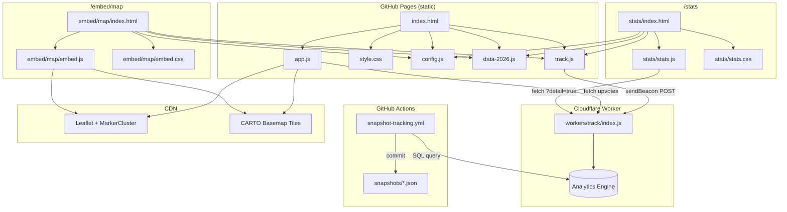
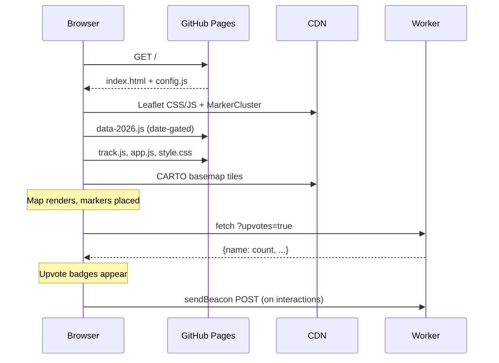
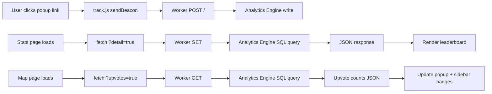
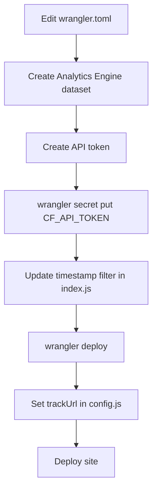

# SB Burger Week 2026 Map

[](https://hits.sh/sbburgerweekmap.com/)

An interactive map of all participating restaurants for [Santa Barbara Burger Week 2026](https://www.independent.com/2026/02/18/go-beast-mode-for-santa-barbara-burger-week-2026/) (Feb 19–25). Browse, filter, share, and plan your burger week from your phone or desktop.

**Live at [sbburgerweekmap.com](https://sbburgerweekmap.com)**

## Features

- **Interactive map** — Leaflet map with color-coded markers by area, marker clustering, and emoji overlays
- **Search & filter** — Find restaurants by name, menu item, or area. Filter by dietary tags (vegetarian, gluten-free, fries). Area filter zooms to fit
- **Deep linking** — Share a direct link to any restaurant (e.g. `sbburgerweekmap.com/#arnoldis`). URL hash updates as you browse
- **Share button** — Each popup has a Share button — native share sheet on mobile, clipboard copy on desktop
- **Upvotes** — Thumbs-up button on each popup with live counts fetched from the Worker API. Persists locally via localStorage
- **Multi-item menus** — Restaurants with multiple specials show each item with its own name and description
- **Sectioned popup cards** — Icon buttons for Apple Maps, Google Maps, Instagram, Website, Call, and Share
- **Sidebar interaction** — Hover a restaurant in the list to highlight it on the map. Click to fly to it and open its popup
- **Random picker** — Burger emoji button picks a random restaurant from the current filtered list and flies to it
- **Pick Favorites** — Printer icon toggles checklist mode with All/None bulk actions. Selections persist via localStorage
- **Print Selected** — Generates a printable page with a numbered map, grouped restaurant list, and Venmo QR code
- **Mobile-friendly** — Bottom drawer with three-stop snap (peek, half, full), drag handle, and touch-friendly targets
- **Embeddable map** — Self-contained iframe-friendly version at `/embed/map` with its own JS/CSS
- **Stats dashboard** — Live leaderboard at `/stats` showing per-restaurant engagement scores
- **Click tracking** — Cloudflare Worker + Analytics Engine tracks views, directions, website clicks, calls, shares, and upvotes
- **About modal** — Info modal with source link, tip jar, embed link, stats, GitHub, and contact email
- **Date-gated data** — Before `dataLiveDate`, loads skeleton data; after, loads full menu details
- **Source monitoring** — GitHub Actions workflow checks the source article daily and opens an issue if content changes
- **Placeholder support** — Restaurants without menu details show "Details coming soon!" in popups and sidebar

## Architecture



### Page Load Sequence



### Click Tracking Flow



## File Structure

```
sbburgerweek/
├── index.html              # Main page shell (OG tags, favicon, analytics)
├── app.js                  # Map logic, sidebar, filtering, search, deep linking
├── style.css               # All styles including mobile responsive layout
├── config.js               # Theme config — edit this to rebrand
├── data.js                 # Restaurant data skeleton (empty menuItems)
├── data-2026.js            # Production data with full menuItems
├── mock_data.js            # Test data with placeholder names/descriptions
├── track.js                # sendBeacon tracker (reads THEME.trackUrl)
├── apply-theme.py          # Generates OG image, updates CNAME/HTML/README
├── og-image.svg            # Social preview image (source)
├── og-image.png            # Social preview image (generated)
├── icon-vegetarian.svg     # Dietary tag icon
├── icon-gf.svg             # Dietary tag icon
├── icon-fries.svg          # Dietary tag icon
├── venmo_qr.png            # Venmo QR code
├── CNAME                   # Custom domain for GitHub Pages
│
├── snapshots/              # Daily tracking data snapshots (committed by GitHub Action)
│   └── tracking-YYYY-MM-DD.json
│
├── embed/
│   ├── index.html          # Embed showcase page (/embed)
│   └── map/
│       ├── index.html      # Embeddable map page (/embed/map)
│       ├── embed.js        # Self-contained map logic
│       └── embed.css       # Compact styles (280px sidebar)
│
├── stats/
│   ├── index.html          # Stats dashboard page (/stats)
│   ├── stats.js            # Fetches ?detail=true, renders leaderboard
│   └── stats.css           # Dashboard styles
│
└── workers/track/
    ├── index.js            # Cloudflare Worker (POST + GET endpoints)
    ├── wrangler.toml       # Worker config (binding, dataset)
    └── pull-data.sh        # Dump all tracking events as JSON
```

## Data Format

Each restaurant in `data.js` / `data-2026.js`:

```js
{
  name: "Mesa Burger (De La Vina)",
  address: "2032 De La Vina St, Santa Barbara, CA 93105",
  area: "Other SB",
  lat: 34.4368,
  lng: -119.7210,
  mapUrl: "https://maps.app.goo.gl/...",
  appleMapsUrl: "https://maps.apple.com/place?...",  // or null
  website: "https://mesaburger.com",                 // or null
  phone: "805-963-1346",                             // or null
  instagram: "mesaburger",                           // or null (handle only, no @)
  vegetarian: true,                                  // dietary tag flags
  glutenFree: false,
  hasFries: true,
  menuItems: [
    { name: "The Beast", description: "Double patty with house sauce." },
    { name: "Veggie Smash", description: null },     // null = "coming soon"
  ],
}
```

- Empty `menuItems: []` → "Details coming soon!" in popup and sidebar
- `description: null` → individual item shows "More details coming soon!"
- `appleMapsUrl: null` → falls back to address-based directions
- Area colors are defined in `AREA_COLORS` at the top of the data file

## Worker API

The Cloudflare Worker (`workers/track/index.js`) exposes three endpoints:

| Method | Path / Params    | Purpose                          | Response                                       |
| ------ | ---------------- | -------------------------------- | ---------------------------------------------- |
| POST   | `/`              | Record a tracking event          | `"ok"`                                         |
| GET    | `/`              | Per-restaurant action breakdown  | `{name: {view: N, directions-apple: N, ...}}`  |
| GET    | `/?upvotes=true` | Net upvote counts                | `{name: N, ...}`                               |

**Tracked actions:** `view`, `directions-apple`, `directions-google`, `website`, `phone`, `instagram`, `share`, `upvote`, `un-upvote`, `deeplink`, `filter-area`, `filter-tag`, `stats-view`

**POST body:** `{ "action": "view", "label": "Mesa Burger" }`

All responses include CORS headers (echoes request Origin) and a 5-minute cache.

## Tracking Data Snapshots

Cloudflare Analytics Engine has a 90-day retention limit. To preserve tracking data beyond that window, a GitHub Action (`.github/workflows/snapshot-tracking.yml`) runs daily and commits a JSON snapshot to `snapshots/tracking-YYYY-MM-DD.json`.

Each snapshot contains:

```json
{
  "timestamp": "2026-02-20T14:00:00Z",
  "detail": {
    "Mesa Burger": { "view": 42, "directions-apple": 5, "share": 3 }
  },
  "upvotes": {
    "Mesa Burger": 12
  }
}
```

**Required secrets:** `CF_ACCOUNT_ID` and `CF_API_TOKEN` (same token used for the Worker). You can also trigger it manually from the Actions tab.

## Stats Dashboard

The stats page at `/stats` fetches the Worker's detail endpoint and computes an engagement score per restaurant:

```
Score = (Directions + Phone) × 3
      + (Direct Links + Shares + Likes) × 2
      + (Website + Instagram + Views) × 1
```

The leaderboard table is sortable by clicking column headers (3-way toggle: desc → asc → default). Restaurant names link back to the main map via deep-link anchors. A separate section shows filter usage stats (area + dietary tag taps).

## Run Locally

```bash
python3 -m http.server 8000
```

Open [http://localhost:8000](http://localhost:8000). A local server is required — `file://` won't work due to script loading.

To test with placeholder data, add `?year=9999` to the URL (triggers a fallback to `data.js` skeleton).

## Fork It — Setup Guide

Have a burger week (or any food event) in your city? Fork this repo and make it your own.

We'll use **"SB Burrito Week"** as the running example.

---

### Step 1: Fork & Clone

```bash
git clone https://github.com/YOUR_USERNAME/sbburgerweek.git
cd sbburgerweek
python3 -m http.server 8000
# Open http://localhost:8000
```

---

### Step 2: Add Your Restaurant Data

Edit `data.js` — see [Data Format](#data-format) above. Update `AREA_COLORS` at the top to match your areas and color scheme.

**Tips for coordinates and map links:**

- Search on [Google Maps](https://maps.google.com), right-click the pin → copy coordinates
- Click "Share" on Google Maps → copy link for `mapUrl`
- Search on Apple Maps → tap "Share" → copy link for `appleMapsUrl`
- Fallback Google Maps URL: `https://www.google.com/maps/search/?api=1&query=123+Main+St+City+CA`
- If `appleMapsUrl` is `null`, the app uses address-based directions

---

### Step 3: Set the Map Center

Update the starting coordinates in **two files**:

- **`app.js`** (~line 72): `.setView([34.42, -119.70], 13)`
- **`embed/map/embed.js`** (~line 80): `.setView([34.42, -119.70], 13)`

Change `[lat, lng]` to your city's center. Adjust the zoom level as needed (higher = more zoomed in).

---

### Step 4: Configure Your Theme

Edit `config.js`:

```js
const THEME = {
  eventName: "SB Burrito Week 2026",
  eventDates: "Mar 5–11",
  emoji: "🌯",
  ogLine1: "Santa Barbara",
  ogLine2: "Burrito Week 2026",
  itemLabel: "burrito",
  itemLabelPlural: "burritos",
  siteUrl: "https://sbburritoweekmap.com",
  description: "Interactive map of all participating restaurants. Search, filter by area, and get directions.",
  sourceLabel: "Source: The Independent",
  sourceUrl: "https://example.com/burrito-week-article",
  venmoUser: "yourusername",       // null to hide tip jar
  venmoNote: "Buy me a burrito?",
  venmoAmount: 5,
  storageKey: "sbburritoweek-checklist",
  printTitle: "SB Burrito Week 2026 — My Picks",
  dataLiveDate: "2026-03-04",     // null to always show full data
  trackUrl: null,                 // Cloudflare Worker URL, null to disable
  cfAnalyticsToken: null,         // Cloudflare Web Analytics token, null to disable
  contactDomain: "example.com",   // null to hide contact link
};
```

See the [Config Reference](#config-reference) table for details on every field.

---

### Step 5: Generate Assets

```bash
python3 apply-theme.py
```

**Requires:** Python 3 + ImageMagick (`brew install imagemagick`)

**Updates:** `og-image.svg`, `og-image.png` (social preview), `CNAME`, `index.html` (favicon, title, header, analytics snippet), `embed/index.html`, `README.md`

---

### Step 6: Deploy to GitHub Pages

1. Go to your repo → **Settings** → **Pages**
2. Select **Deploy from a branch** → **main** → **/ (root)** → **Save**
3. Live at `https://YOUR_USERNAME.github.io/sbburgerweek/`

#### Custom Domain (optional)

| Type  | Name | Content                 |
| ----- | ---- | ----------------------- |
| A     | @    | 185.199.108.153         |
| A     | @    | 185.199.109.153         |
| A     | @    | 185.199.110.153         |
| A     | @    | 185.199.111.153         |
| CNAME | www  | YOUR_USERNAME.github.io |

> **Cloudflare DNS users:** Set proxy to **OFF** (grey cloud) for all records. GitHub Pages needs direct SSL termination.

---

### Step 7: Cloudflare Web Analytics (optional)

1. Create a free [Cloudflare account](https://dash.cloudflare.com/sign-up)
2. Go to **Web Analytics** → **Add a site** → copy the token
3. Set `cfAnalyticsToken` in `config.js`
4. Run `python3 apply-theme.py`
5. Deploy

---

### Step 8: Click Tracking + Stats (optional)



1. **Install Wrangler:**
   ```bash
   npm install -g wrangler && wrangler login
   ```

2. **Create an Analytics Engine dataset** in Cloudflare dashboard → Workers & Pages → Analytics Engine

3. **Update `workers/track/wrangler.toml`:**
   ```toml
   name = "sbburritoweek-track"
   main = "index.js"
   compatibility_date = "2024-01-01"

   [vars]
   ACCOUNT_ID = "YOUR_CLOUDFLARE_ACCOUNT_ID"

   [[analytics_engine_datasets]]
   binding = "TRACKER"
   dataset = "sbburritoweek"
   ```

4. **Create an API token** (Cloudflare dashboard → My Profile → API Tokens) with permissions: Analytics Engine Read + Workers Scripts Edit

5. **Add the token as a Worker secret:**
   ```bash
   cd workers/track
   wrangler secret put CF_API_TOKEN
   ```

6. **Update the event start date** in `workers/track/index.js` — find the `WHERE timestamp >= toDateTime('...')` lines and set your event start date in UTC

7. **Deploy:**
   ```bash
   wrangler deploy
   ```

8. **Set `trackUrl` in `config.js`** to the Worker URL printed by Wrangler

9. **Verify:** Open the site, interact with popups, then check `wrangler tail` for POST requests

---

### Step 9: Tracking Data Snapshots (optional)

Cloudflare Analytics Engine only retains data for 90 days. To preserve your tracking data beyond that, set up the snapshot workflow:

1. **Add repo secrets** (`Settings → Secrets and variables → Actions`):
   - `CF_ACCOUNT_ID` — your Cloudflare account ID
   - `CF_API_TOKEN` — same API token from Step 8

2. **Update `.github/workflows/snapshot-tracking.yml`:**
   - Change the cron schedule `19-28 2` to match your event month/days
   - Update the `WHERE timestamp >= toDateTime('...')` dates to your event start

3. **Push and enable** — the workflow runs daily during your event window and on manual dispatch. Each run commits a JSON snapshot to `snapshots/tracking-YYYY-MM-DD.json` with per-restaurant action breakdowns and upvote counts.

---

### Step 10: Embed (optional)

```html
<iframe
  src="https://sbburritoweekmap.com/embed/map"
  width="100%"
  height="600"
  style="border: none; border-radius: 8px;"
  title="SB Burrito Week 2026 Interactive Map"
  loading="lazy"
  allowfullscreen
></iframe>
```

The embed shares `data.js` and `config.js` with the main site (via relative paths) but has its own `embed.js` and `embed.css`. Feature changes to `app.js` / `style.css` do **not** propagate to the embed. A showcase page lives at `/embed`.

---

## Config Reference

| Field                           | Type           | Description                                                             |
| ------------------------------- | -------------- | ----------------------------------------------------------------------- |
| `eventName`                     | string         | Event title shown in header, about modal, and OG tags                   |
| `eventDates`                    | string         | Date range shown in header                                              |
| `emoji`                         | string         | Emoji for favicon, markers, random picker, and popups                   |
| `ogLine1` / `ogLine2`           | string         | Two-line text for OG social preview image                               |
| `itemLabel` / `itemLabelPlural` | string         | What to call the menu item (e.g. "burrito" / "burritos")                |
| `siteUrl`                       | string         | Full URL for OG tags, share links, and embed snippets                   |
| `description`                   | string         | Meta description for search engines                                     |
| `sourceLabel` / `sourceUrl`     | string         | Header link text and URL for source article                             |
| `venmoUser`                     | string \| null | Venmo username for tip jar. `null` hides the link                       |
| `venmoNote`                     | string         | Pre-filled Venmo payment note                                           |
| `venmoAmount`                   | number         | Pre-filled Venmo amount                                                 |
| `storageKey`                    | string         | localStorage key for favorites (unique per event)                       |
| `printTitle`                    | string         | Title shown on the printable picks page                                 |
| `dataLiveDate`                  | string \| null | `"YYYY-MM-DD"` to gate full data until that date. `null` to always show |
| `trackUrl`                      | string \| null | Cloudflare Worker URL for click tracking. `null` to disable             |
| `cfAnalyticsToken`              | string \| null | Cloudflare Web Analytics token. `null` to disable                       |
| `contactDomain`                 | string \| null | Domain for auto-generated contact email. `null` to hide                 |

## Tech Stack

- **Map:** [Leaflet](https://leafletjs.com/) + [MarkerCluster](https://github.com/Leaflet/Leaflet.markercluster) + [CARTO](https://carto.com/) basemap tiles
- **Hosting:** GitHub Pages with custom domain via Cloudflare DNS
- **Tracking:** Cloudflare Worker + Analytics Engine (free tier)
- **Analytics:** Cloudflare Web Analytics (free, cookieless)
- **Build:** None — plain HTML/CSS/JS, no npm, no bundler

## Issues & Feedback

Found a bug, missing restaurant, or wrong detail? [Open an issue](../../issues).

## Author

Made by [Sam Gutentag](https://www.gutentag.world) in Santa Barbara, CA.
